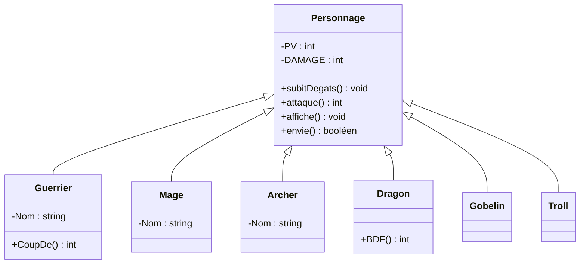

# POO-Prosit4

```mermaid
classDiagram
class Personnage {
    -PV : int
    -DAMAGE : int
    +subitDegats() void
    +attaque() int
    +affiche() void
    +envie() booléen
}

class Guerrier {
    -Nom : string
    +CoupDe() int
}

class Mage {
    -Nom : string
}

class Archer {
    -Nom : string
}

class Dragon {
    +BDF() int    
}

class Gobelin {
    
}

class Troll {
    
}

Personnage<|--Guerrier
Personnage<|--Mage
Personnage<|--Archer
Personnage<|--Dragon
Personnage<|--Gobelin
Personnage<|--Troll

```