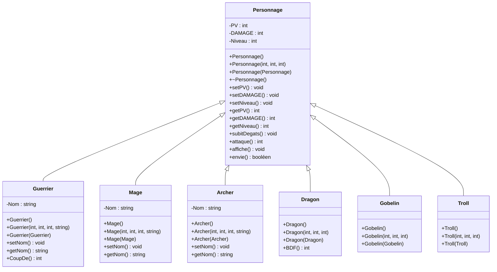

# POO-Prosit4

```mermaid
classDiagram
class Personnage {
    -PV : int
    -DAMAGE : int
    -Niveau : int
    +Personnage()
    +Personnage(int, int, int)
    +Personnage(Personnage)
    +~Personnage()
    +setPV() void
    +setDAMAGE() void
    +setNiveau() void
    +getPV() int
    +getDAMAGE() int
    +getNiveau() int
    +subitDegats() void
    +attaque() int
    +affiche() void
    +envie() booléen
}

class Guerrier {
    -Nom : string
    +Guerrier()
    +Guerrier(int, int, int, string)
    +Guerrier(Guerrier)
    +setNom() void
    +getNom() string
    +CoupDe() int
}

class Mage {
    +Mage()
    +Mage(int, int, int, string)
    +Mage(Mage)
    +setNom() void
    +getNom() string
    -Nom : string
}

class Archer {
    +Archer()
    +Archer(int, int, int, string)
    +Archer(Archer)
    +setNom() void
    +getNom() string
    -Nom : string
}

class Dragon {
    +Dragon()
    +Dragon(int, int, int)
    +Dragon(Dragon)
    +BDF() int    
}

class Gobelin {
    +Gobelin()
    +Gobelin(int, int, int)
    +Gobelin(Gobelin)
}

class Troll {
    +Troll()
    +Troll(int, int, int)
    +Troll(Troll)
}

Personnage<|--Guerrier
Personnage<|--Mage
Personnage<|--Archer
Personnage<|--Dragon
Personnage<|--Gobelin
Personnage<|--Troll

```